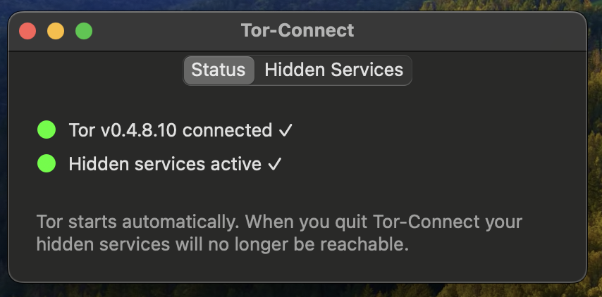
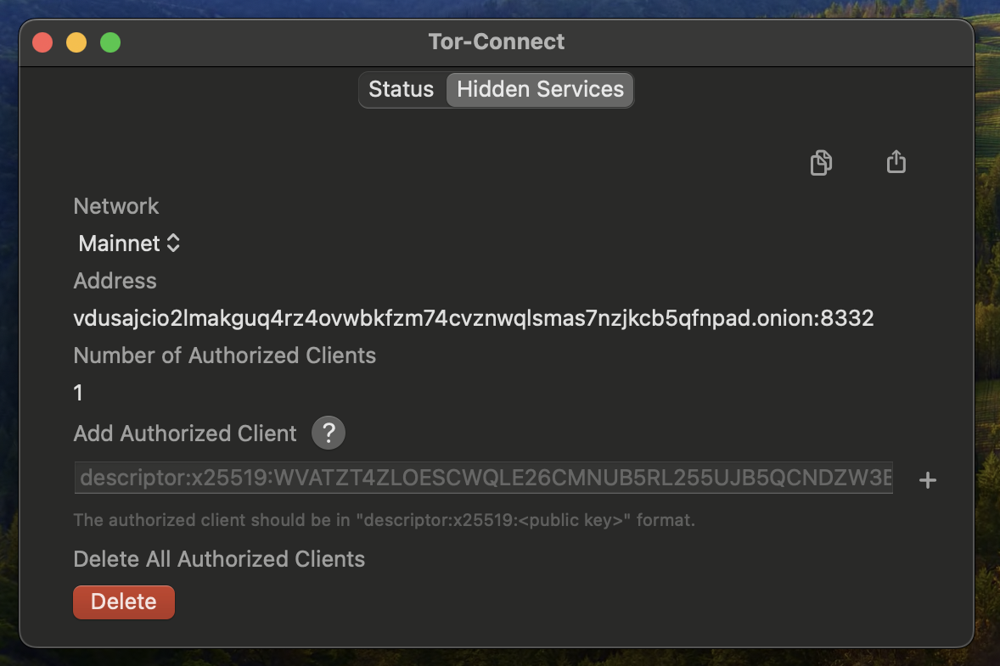

#  Tor-Connect Beta

Tor-Connect is a simple app with which runs the latest stable release of Tor.
The point of Tor-Connect is to make running Tor on your Mac and creating/managing 
hidden services for Bitcoin Core easy for anyone. 

 

## How to use it?
- Download the release [here](https://github.com/Fonta1n3/Tor-Connect/releases/tag/v1.0.0-alpha).
- Open the app, thats it! 
- In order to connect Fully Noded you need to go to node manager and 
paste in the hidden service address which you can access from the "Hidden Services" tab in
Tor-Connect, there is a share and copy button in the top right of Tor-Connect.

## Dependencies
[Tor.Framework](https://github.com/iCepa/Tor.framework) is the only dependency.

## Anonymity and Security
This app and as far as I know its frameworks (Tor.Framework) and their dependencies 
have not been properly audited, no guarantees that it is safe, private or anonymous to use!

## Features
- Creates hidden services for Bitcoin Core mainnet, testnet, signet and regtest default rpcports.
- Allows you to add `authorized_clients` utilizing Tor V3 authentication.
- Embeds Tor.
- Automatically starts Tor and configures your hidden services when you launch the app.
- Quitting the app quits the Tor process and your hidden services will not be reachable.

## TODO
- Find out how low we can go on the minimum supported OS version.
- App Store release.
- More fine grained controls for advanced users (custom rpcports).
- Full custom torrc into a UI.
- Fine grained control over hidden services.
- Show live log.

